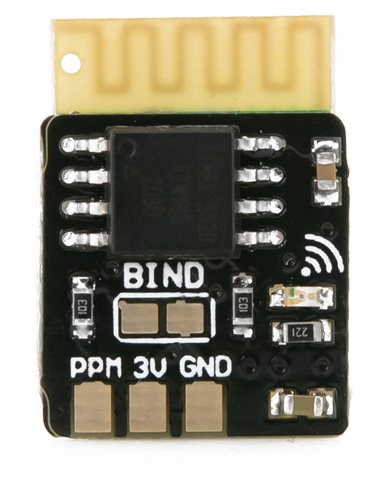

This repository contains a little Arduino library that uses 
<a href="https://en.wikipedia.org/wiki/Interrupt">interrupts</a> to read
the so-called CPPM (Combined Pulse-Pulse Modulation) signal from an R/C
receiver like the FrSky Micro RX.  Although other such libraries exist, I
wanted one that (1) was absolutely minimal (no assumptions about channel
identities like pitch, roll; no hardware-specific optimizations) and (2) would
work with all Arduino-compatible hardware (e.g., Arduino Uno; Teensy; and
STM32L4-based boards from <a href="https://www.tindie.com/stores/TleraCorp/">Tlera Corp.</a>) 
Thanks to the generosity of Greg Tomasch, I am able to share this library,
based on Greg's code.  I have tested it with an Arduino Uno, Teensy 3.2, and
Ladybug STM32L432 boards, using the FrSky MicoRX.  

For eight-bit Arduino boards (Uno, Mega), 
<a href="https://www.arduino.cc/en/Reference/AttachInterrupt">this page</a> 
shows the pins supporting interrupts.  More modern, 32-bit boards (Due, Teensy,
STM32L4 boards) support interrupts on all digital pins.
